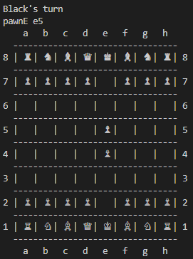

# Terminal chess program written in Java
This is a terminal chess game I made to better understand object oriented programming.

This program is a local two player chess game with only a few features left out:
Firstly, instead of having the option to promote pawns to any piece, pawns auto-promote to a queen.
Secondly, *en passant* has not yet been integrated.
Thirdly, I omitted a few of the less common stalemate rules including, threefold repetiton, fifty-move rule.

If you are using a terminal with a dark background the color of the pieces will appear to be flipped.
Make sure your terminal is displaying UTF-8 properly, otherwise the chess pieces will print as ?

## How to build and run
$ git clone https://github.com/Bglaws/Chess
$ cd Chess/src
$ javac Game.java
$ java Game

### Pictures

